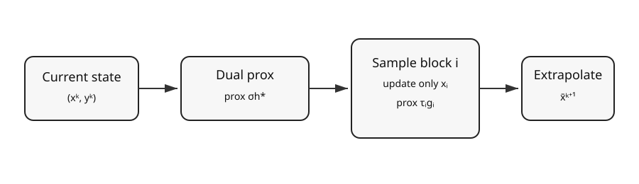

# Primal-Dual-Blocks

A research-oriented Python implementation of **block-coordinate primal-dual splitting** for large-scale convex, nonsmooth optimization problems of the form

[
min_{x\in\mathbb{R}^n} g(x) + h(Kx),
]

where (g) is block-separable, (h) may be non-differentiable, and (K) is a linear operator.

<p align="center">
  
</p>

## Why this repository?

Full primal-dual methods update every primal coordinate at every iteration. For very large problems, that can be unnecessarily expensive. This project updates only one (or a small subset) of primal blocks while retaining a dual step, making it useful for structured sparse models, inverse problems, imaging, and distributed/parallel optimization research.

### Highlights

- Chambolle-Pock-style primal-dual core with randomized block updates.
- Generic proximal-operator interface.
- Reproducible LASSO/sparse-recovery example.
- Objective, feasibility, and update-norm diagnostics.
- Matplotlib-based convergence visualization.
- Benchmark harness for different block counts.
- Tests for proximal operators, dimensions, and solver behavior.
- Research branches for adaptive sampling, parallel/batched updates, and richer visualization.
- GitHub Actions CI.

## Mathematical model

The baseline solver targets

[
min_x g(x) + h(Kx),
]

with block decomposition (x=(x_1,\dots,x_B)) and

[
g(x)=\sum_{i=1}^{B} g_i(x_i).
]

A full dual step is followed by a randomized primal block update:

[
y^{k+1}=\operatorname{prox}_{\sigma h^*}
\left(y^k+\sigma K\bar{x}^k\right),
]

[
x_i^{k+1}=\operatorname{prox}_{\tau_i g_i}
\left(x_i^k-\tau_i K_i^T y^{k+1}\right).
]

Only the selected block (i) is changed in that primal step. The implementation uses the conservative condition
(	au\sigma\lVert K\rVert_2^2<1) for the default global step sizes.

## Quick start

```bash
git clone https://github.com/halim-abdul/Primal-Dual-Blocks.git
cd Primal-Dual-Blocks

python -m venv .venv
# Linux/macOS
source .venv/bin/activate
# Windows PowerShell
# .venv\Scripts\Activate.ps1

pip install -e .[dev]
python examples/run_lasso.py --iterations 1500 --blocks 8
```

The example writes a CSV history and generates convergence figures under `artifacts/`.

## Minimal Python example

```python
import numpy as np

from primal_dual_blocks.problems import make_lasso_problem
from primal_dual_blocks.solver import BlockPrimalDual

problem = make_lasso_problem(m=120, n=300, sparsity=18, lam=0.05, seed=7)

solver = BlockPrimalDual(
    K=problem["K"],
    prox_g_blocks=problem["prox_g_blocks"],
    prox_h_conj=problem["prox_h_conj"],
    blocks=problem["blocks"],
    seed=7,
)

result = solver.run(
    x0=np.zeros(problem["K"].shape[1]),
    y0=np.zeros(problem["K"].shape[0]),
    n_iter=1200,
    objective=problem["objective"],
)

print("final objective:", result.history["objective"][-1])
```

## Reproducible benchmark

```bash
python experiments/benchmark_lasso.py \
  --iterations 1200 \
  --block-counts 1 4 8 16 \
  --output artifacts/benchmark.csv

python visualization/plot_convergence.py \
  --csv artifacts/benchmark.csv \
  --output-dir artifacts/figures
```

The benchmark reports wall-clock time, final objective, residual norm, and update statistics. Runtime comparisons depend on hardware and problem size; the repository does not hard-code benchmark claims.

## Project layout

```text
Primal-Dual-Blocks/
├── src/primal_dual_blocks/
│   ├── solver.py          # randomized block primal-dual solver
│   ├── prox.py            # reusable proximal operators
│   └── problems.py        # synthetic LASSO/sparse-recovery generator
├── examples/
│   └── run_lasso.py
├── experiments/
│   └── benchmark_lasso.py
├── visualization/
│   └── plot_convergence.py
├── tests/
├── docs/
│   ├── MATHEMATICS.md
│   ├── ARCHITECTURE.md
│   └── figures/
└── .github/workflows/ci.yml
```

## Development branches

The repository also contains focused research branches:

- `research/adaptive-block-sampling` — non-uniform block selection based on running update scores.
- `feature/batched-block-updates` — experimental multi-block Jacobi-style update support.
- `feature/visualization-report` — richer experiment-report plotting utilities.
- `research/scaling-study` — scripted scaling experiments over dimensions and block counts.

These branches intentionally isolate experimental ideas from the stable baseline on `main`.

## Design principles

1. **Small core, explicit mathematics.** The solver is intentionally readable enough to compare line-by-line with the update equations.
2. **Reproducibility first.** Every stochastic component accepts a seed and experiments export machine-readable CSV.
3. **No hidden performance claims.** Figures are generated from actual run logs.
4. **Research extensibility.** Sampling, proximal maps, and block partitions can be replaced without rewriting the full solver.

## Testing

```bash
pytest -q
```

## Notes on convergence

The implementation is a practical research baseline, not a proof assistant. Convergence guarantees depend on convexity, the selected update scheme, block sampling assumptions, and compatible step sizes. See [docs/MATHEMATICS.md](docs/MATHEMATICS.md) for the assumptions used by the baseline implementation.

## References

- A. Chambolle and T. Pock, *A First-Order Primal-Dual Algorithm for Convex Problems with Applications to Imaging*, Journal of Mathematical Imaging and Vision, 2011.
- P. L. Combettes and J.-C. Pesquet, work on primal-dual splitting methods for monotone inclusions and convex optimization.
- Literature on randomized/block-coordinate primal-dual methods for large-scale composite optimization.

## License

No license has been selected yet. Add a license before redistributing or packaging the project.
